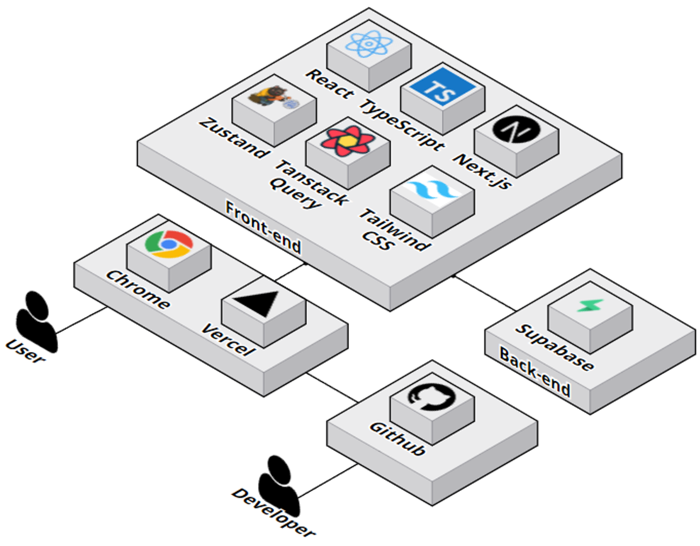
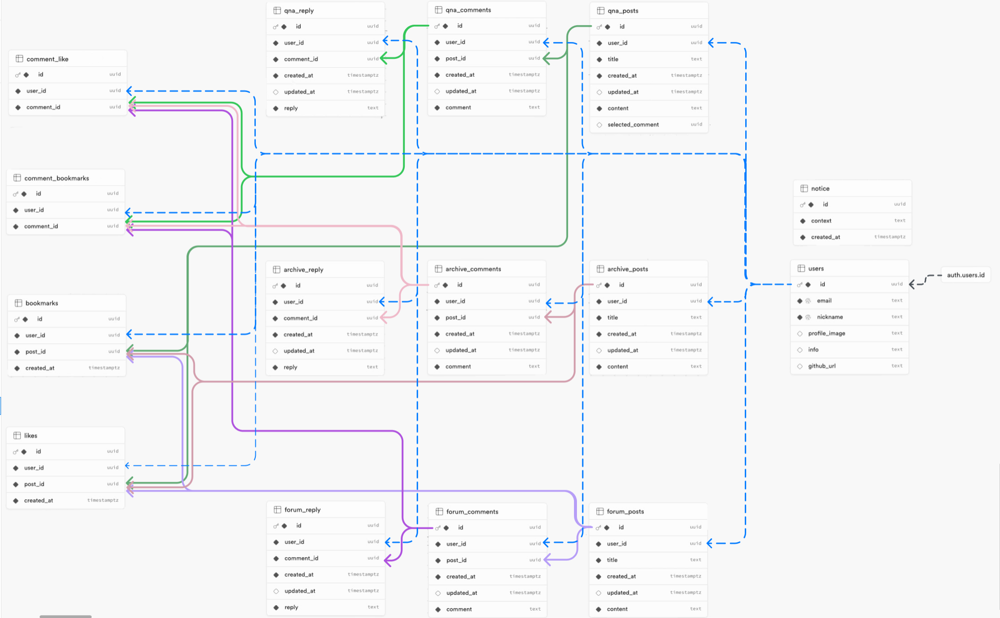

# Final Project : `<div>`

## 📝 기획

### **< 프론트엔드 개발자를 위한 종합 커뮤니티 사이트 >**
<br>

### 👋 프론트 엔드 개발자 포럼에 오신 것을 환영합니다.

이곳은 최신 트렌드 토론, 코드 리뷰, 추천 사이트 공유, 질의 응답, 라이브러리 등을 통해 개발자들이 협력하고 성장할 수 있는 커뮤니티입니다. 함께 지식을 나누고 문제를 해결하며 함께 발전해 보세요. 활발한 참여와 공유를 기대합니다!

<br>

### **💡 사이트 소개**

프론트엔드 개발자 여러분, 환영합니다! 저희 사이트는 다음과 같은 기능을 제공합니다 : )

- **🗣️소통 :** 다양한 주제에 대해 의견을 나누고, 다른 개발자들의 경험과 통찰을 공유하며 활발히 소통할 수 있는 공간입니다.
- 🤔 **질문** :  개발 중 궁금한 점이 있거나 해결하기 어려운 문제가 생겼을 때, 다른 개발자 들과 지식을 공유하고 조언을 받을 수 있습니다.
- 💾 **코드 저장**: 코드 저장 기능을 통해 언제 어디서든 자신의 작업을 보관하고 필요할 때 바로 접근할 수 있습니다.


<br>

**`서비스 링크`** : [ 🔗 div 서비스 링크](https://www.div.today/)

**`피그마 링크`** : [ 🔗 div 피그마 링크](https://www.figma.com/design/2lII1sCPCt4isWAPofxaiV/B08%EC%A1%B0-%EC%84%B8%EB%AF%B8%EC%BD%9C%EB%A1%A0?node-id=2009-4&t=0R5QpcALqkuAm0Id-0)

<br>

## 👥👤👥👤 구성원

<table>
  <tbody>
    <tr>
      <th className='text-center justify-center'><b>팀장: 김준영</b></th>
      <th className='text-center justify-center'><b>부팀장: 신자영</b></th>
      <th className='text-center justify-center'><b>팀원: 염경원</b></th>
      <th className='text-center justify-center'><b>팀원: 전태영</b></th>
      <th className='text-center justify-center'><b>팀원: 김영은</b></th>
      <th className='text-center justify-center'><b>디자이너: 김세미</b></th>
    </tr>
    <tr>
      <td align="center"></td>
      <td align="center"></td>
      <td align="center"></td>
      <td align="center"></td>
      <td align="center"></td>
      <td align="center"></td>
     </tr>
      <td align="center"><a href="https://github.com/JvnKim">@jvn</a></td>
      <td align="center"><a href="https://github.com/tpring">@tpring</a></td>
      <td align="center"><a href="https://github.com/YCDM03">@YCDM03</a></td>
      <td align="center"><a href="https://github.com/Floweringworld">@Floweringworld</a></td>
      <td align="center"><a href="https://github.com/youngeun0407">@youngeun0407</a></td>
      <td align="center"><a href="https://github.com/kalummy">@kalummy</a></td>
    </tr>
  </tbody>
</table>

## 🌱 역할분담

| 이름   | 분담                            | 블로그                              |
| ------ | ------------------------------- | ----------------------------------- |
| 김준영 | 헤더, 각 게시물 페이지          | https://velog.io/@jvn/posts         |
| 신자영 | 마이페이지, 검색                | https://tpring.tistory.com/         |
| 염경원 | 게시물 작성, Q&A 디테일 페이지  | https://blog.naver.com/stanwind     |
| 전태영 | 메인페이지, Forum 디테일 페이지 | https://floweringworld.tistory.com/ |
| 김영은 | 인증인가, Library 디테일 페이지 | https://velog.io/@youngni-bbangni   |
| 김세미 | 디자인                          |                                     |

## 🏗 아키텍쳐



## 🖥️ 기술 스택


## 📊 ERD



## 📁 폴더 구조

<details>
<summary>폴더 구조</summary>
<br>

```
📦src
 ┣ 📂actions
 ┃ ┣ 📜revalidate.ts
 ┃ ┗ 📜revalidatePostTag.ts
 ┣ 📂app
 ┃ ┣ 📂(home)
 ┃ ┃ ┣ 📂(auth)
 ┃ ┃ ┃ ┣ 📂_components
 ┃ ┃ ┃ ┃ ┣ 📜CheckboxGroup.tsx
 ┃ ┃ ┃ ┃ ┣ 📜LoginForm.tsx
 ┃ ┃ ┃ ┃ ┣ 📜OAuthButtons.tsx
 ┃ ┃ ┃ ┃ ┣ 📜OAuthLoginStatus.tsx
 ┃ ┃ ┃ ┃ ┣ 📜OAuthNicknameModal.tsx
 ┃ ┃ ┃ ┃ ┣ 📜OAuthNicknameModalWrapper.tsx
 ┃ ┃ ┃ ┃ ┗ 📜SignupForm.tsx
 ┃ ┃ ┃ ┣ 📂login
 ┃ ┃ ┃ ┃ ┗ 📜page.tsx
 ┃ ┃ ┃ ┗ 📂signup
 ┃ ┃ ┃ ┃ ┗ 📜page.tsx
 ┃ ┃ ┣ 📂(posts)
 ┃ ┃ ┃ ┣ 📂_components
 ┃ ┃ ┃ ┃ ┣ 📂archive
 ┃ ┃ ┃ ┃ ┃ ┣ 📂skeleton
 ┃ ┃ ┃ ┃ ┃ ┃ ┣ 📜ArchivePostCardSkeleton.tsx
 ┃ ┃ ┃ ┃ ┃ ┃ ┣ 📜ArchivePostsSkeleton.tsx
 ┃ ┃ ┃ ┃ ┃ ┃ ┗ 📜PopularArchiveSwiperSkeleton.tsx
 ┃ ┃ ┃ ┃ ┃ ┣ 📜ArchiveBanner.tsx
 ┃ ┃ ┃ ┃ ┃ ┣ 📜ArchiveBookmarkButton.tsx
 ┃ ┃ ┃ ┃ ┃ ┣ 📜ArchivePostCard.tsx
 ┃ ┃ ┃ ┃ ┃ ┣ 📜ArchivePostCardMobile.tsx
 ┃ ┃ ┃ ┃ ┃ ┣ 📜ArchivePosts.tsx
 ┃ ┃ ┃ ┃ ┃ ┣ 📜Pagination.tsx
 ┃ ┃ ┃ ┃ ┃ ┣ 📜PopularArchiveSwiper.tsx
 ┃ ┃ ┃ ┃ ┃ ┣ 📜SectionHeader.tsx
 ┃ ┃ ┃ ┃ ┃ ┗ 📜SwiperNavigationButton.tsx
 ┃ ┃ ┃ ┃ ┣ 📂archive-detail
 ┃ ┃ ┃ ┃ ┃ ┣ 📂skeleton
 ┃ ┃ ┃ ┃ ┃ ┃ ┗ 📜ArchiveDetailSkeleton.tsx
 ┃ ┃ ┃ ┃ ┃ ┣ 📜ArchiveComments.tsx
 ┃ ┃ ┃ ┃ ┃ ┣ 📜ArchiveDetailPost.tsx
 ┃ ┃ ┃ ┃ ┃ ┣ 📜ArchiveInputComment.tsx
 ┃ ┃ ┃ ┃ ┃ ┣ 📜ArchiveReply.tsx
 ┃ ┃ ┃ ┃ ┃ ┣ 📜ArchiveReplyInput.tsx
 ┃ ┃ ┃ ┃ ┃ ┗ 📜ReplyPageButton.tsx
 ┃ ┃ ┃ ┃ ┣ 📂forum
 ┃ ┃ ┃ ┃ ┃ ┣ 📂card
 ┃ ┃ ┃ ┃ ┃ ┃ ┣ 📜PostCard.tsx
 ┃ ┃ ┃ ┃ ┃ ┃ ┣ 📜PostHeader.tsx
 ┃ ┃ ┃ ┃ ┃ ┃ ┗ 📜PostTags.tsx
 ┃ ┃ ┃ ┃ ┃ ┣ 📂mobile
 ┃ ┃ ┃ ┃ ┃ ┃ ┗ 📜MobileWriteButton.tsx
 ┃ ┃ ┃ ┃ ┃ ┣ 📂skeleton
 ┃ ┃ ┃ ┃ ┃ ┃ ┣ 📜BestForumSkeleton.tsx
 ┃ ┃ ┃ ┃ ┃ ┃ ┗ 📜PostCardSkeleton.tsx
 ┃ ┃ ┃ ┃ ┃ ┣ 📜BestForumPosts.tsx
 ┃ ┃ ┃ ┃ ┃ ┣ 📜CategoryTabs.tsx
 ┃ ┃ ┃ ┃ ┃ ┣ 📜ForumPostsWithCategoryAndSort.tsx
 ┃ ┃ ┃ ┃ ┃ ┗ 📜ScrollToTopButton.tsx
 ┃ ┃ ┃ ┃ ┣ 📂forum-detail
 ┃ ┃ ┃ ┃ ┃ ┣ 📂skeleton
 ┃ ┃ ┃ ┃ ┃ ┃ ┗ 📜ForumDetailSkeleton.tsx
 ┃ ┃ ┃ ┃ ┃ ┣ 📜ForumComments.tsx
 ┃ ┃ ┃ ┃ ┃ ┣ 📜ForumDetailPost.tsx
 ┃ ┃ ┃ ┃ ┃ ┣ 📜ForumDetailPostMobile.tsx
 ┃ ┃ ┃ ┃ ┃ ┣ 📜ForumReply.tsx
 ┃ ┃ ┃ ┃ ┃ ┣ 📜ForumReplyInput.tsx
 ┃ ┃ ┃ ┃ ┃ ┗ 📜InputComment.tsx
 ┃ ┃ ┃ ┃ ┗ 📂qna
 ┃ ┃ ┃ ┃ ┃ ┣ 📂banner
 ┃ ┃ ┃ ┃ ┃ ┃ ┗ 📜QnaBanner.tsx
 ┃ ┃ ┃ ┃ ┃ ┣ 📂popular-qna
 ┃ ┃ ┃ ┃ ┃ ┃ ┣ 📜PopualrQnaPagination.tsx
 ┃ ┃ ┃ ┃ ┃ ┃ ┣ 📜PopularQnaPostItem.tsx
 ┃ ┃ ┃ ┃ ┃ ┃ ┗ 📜PopularQnaPosts.tsx
 ┃ ┃ ┃ ┃ ┃ ┣ 📂resent-qna
 ┃ ┃ ┃ ┃ ┃ ┃ ┣ 📜Pagination.tsx
 ┃ ┃ ┃ ┃ ┃ ┃ ┣ 📜QnaPostItemSelected.tsx
 ┃ ┃ ┃ ┃ ┃ ┃ ┣ 📜QnaPostItemWaiting.tsx
 ┃ ┃ ┃ ┃ ┃ ┃ ┣ 📜ResentQnaPosts.tsx
 ┃ ┃ ┃ ┃ ┃ ┃ ┗ 📜StatusTabs.tsx
 ┃ ┃ ┃ ┃ ┃ ┗ 📂skeleton
 ┃ ┃ ┃ ┃ ┃ ┃ ┣ 📜PopularQnaPostsSkeleton.tsx
 ┃ ┃ ┃ ┃ ┃ ┃ ┗ 📜QnaPostsSkeleton.tsx
 ┃ ┃ ┃ ┣ 📂archive
 ┃ ┃ ┃ ┃ ┣ 📂[id]
 ┃ ┃ ┃ ┃ ┃ ┗ 📜page.tsx
 ┃ ┃ ┃ ┃ ┗ 📜page.tsx
 ┃ ┃ ┃ ┣ 📂forum
 ┃ ┃ ┃ ┃ ┣ 📂[id]
 ┃ ┃ ┃ ┃ ┃ ┗ 📜page.tsx
 ┃ ┃ ┃ ┃ ┗ 📜page.tsx
 ┃ ┃ ┃ ┣ 📂notification
 ┃ ┃ ┃ ┃ ┗ 📜page.tsx
 ┃ ┃ ┃ ┗ 📂qna
 ┃ ┃ ┃ ┃ ┣ 📂[id]
 ┃ ┃ ┃ ┃ ┃ ┣ 📂_components
 ┃ ┃ ┃ ┃ ┃ ┃ ┣ 📂kebob-btn
 ┃ ┃ ┃ ┃ ┃ ┃ ┃ ┣ 📜KebobBtn.tsx
 ┃ ┃ ┃ ┃ ┃ ┃ ┃ ┗ 📜QuestionKebobBtn.tsx
 ┃ ┃ ┃ ┃ ┃ ┃ ┣ 📂qna-comments
 ┃ ┃ ┃ ┃ ┃ ┃ ┃ ┣ 📜Replies.tsx
 ┃ ┃ ┃ ┃ ┃ ┃ ┃ ┣ 📜Reply.tsx
 ┃ ┃ ┃ ┃ ┃ ┃ ┃ ┗ 📜ReplyForm.tsx
 ┃ ┃ ┃ ┃ ┃ ┃ ┣ 📂qna-post
 ┃ ┃ ┃ ┃ ┃ ┃ ┃ ┣ 📜PostingAnswerArea.tsx
 ┃ ┃ ┃ ┃ ┃ ┃ ┃ ┣ 📜PostingQnaAnswer.tsx
 ┃ ┃ ┃ ┃ ┃ ┃ ┃ ┣ 📜QnaAnswer.tsx
 ┃ ┃ ┃ ┃ ┃ ┃ ┃ ┣ 📜QnaAnswers.tsx
 ┃ ┃ ┃ ┃ ┃ ┃ ┃ ┗ 📜QnaQuestion.tsx
 ┃ ┃ ┃ ┃ ┃ ┃ ┣ 📂skeleton
 ┃ ┃ ┃ ┃ ┃ ┃ ┃ ┣ 📜QnaAnswerSkeleton.tsx
 ┃ ┃ ┃ ┃ ┃ ┃ ┃ ┣ 📜QnaReplyFormSkeleton.tsx
 ┃ ┃ ┃ ┃ ┃ ┃ ┃ ┗ 📜QnaReplySkeleton.tsx
 ┃ ┃ ┃ ┃ ┃ ┃ ┗ 📜QnaPost.tsx
 ┃ ┃ ┃ ┃ ┃ ┣ 📂_hooks
 ┃ ┃ ┃ ┃ ┃ ┃ ┣ 📂reply
 ┃ ┃ ┃ ┃ ┃ ┃ ┃ ┣ 📜useAddReplyMutation.ts
 ┃ ┃ ┃ ┃ ┃ ┃ ┃ ┣ 📜useEditReplyMutation.ts
 ┃ ┃ ┃ ┃ ┃ ┃ ┃ ┣ 📜useReply.ts
 ┃ ┃ ┃ ┃ ┃ ┃ ┃ ┗ 📜useReplyForm.ts
 ┃ ┃ ┃ ┃ ┃ ┃ ┣ 📜useDeleteMutation.ts
 ┃ ┃ ┃ ┃ ┃ ┃ ┗ 📜useKebob.ts
 ┃ ┃ ┃ ┃ ┃ ┗ 📜page.tsx
 ┃ ┃ ┃ ┃ ┗ 📜page.tsx
 ┃ ┃ ┣ 📂(profile)
 ┃ ┃ ┃ ┣ 📂_components
 ┃ ┃ ┃ ┃ ┣ 📂SidebarResponsive
 ┃ ┃ ┃ ┃ ┃ ┣ 📜HaderMobile.tsx
 ┃ ┃ ┃ ┃ ┃ ┣ 📜SidebarDesktop.tsx
 ┃ ┃ ┃ ┃ ┃ ┗ 📜SidebarTablet.tsx
 ┃ ┃ ┃ ┃ ┣ 📂myactivities
 ┃ ┃ ┃ ┃ ┃ ┣ 📂common
 ┃ ┃ ┃ ┃ ┃ ┃ ┣ 📜CommentCard.tsx
 ┃ ┃ ┃ ┃ ┃ ┃ ┣ 📜CustomSelect .tsx
 ┃ ┃ ┃ ┃ ┃ ┃ ┣ 📜FilterControls.tsx
 ┃ ┃ ┃ ┃ ┃ ┃ ┣ 📜MyActivitiesPagination.tsx
 ┃ ┃ ┃ ┃ ┃ ┃ ┗ 📜PostCard.tsx
 ┃ ┃ ┃ ┃ ┃ ┣ 📜BookmarksList.tsx
 ┃ ┃ ┃ ┃ ┃ ┣ 📜LikesList.tsx
 ┃ ┃ ┃ ┃ ┃ ┣ 📜MyActivitiesHeader.tsx
 ┃ ┃ ┃ ┃ ┃ ┗ 📜MyPostsList.tsx
 ┃ ┃ ┃ ┃ ┣ 📂setting
 ┃ ┃ ┃ ┃ ┃ ┣ 📂profilemodal
 ┃ ┃ ┃ ┃ ┃ ┃ ┣ 📜CheckCurrentPassword.tsx
 ┃ ┃ ┃ ┃ ┃ ┃ ┣ 📜InfoModal.tsx
 ┃ ┃ ┃ ┃ ┃ ┃ ┣ 📜NewPassword.tsx
 ┃ ┃ ┃ ┃ ┃ ┃ ┣ 📜NicknameModal.tsx
 ┃ ┃ ┃ ┃ ┃ ┃ ┣ 📜PasswordInput.tsx
 ┃ ┃ ┃ ┃ ┃ ┃ ┗ 📜PasswordModal.tsx
 ┃ ┃ ┃ ┃ ┃ ┣ 📂settingresponsive
 ┃ ┃ ┃ ┃ ┃ ┃ ┣ 📜InfoModalFlow.tsx
 ┃ ┃ ┃ ┃ ┃ ┃ ┣ 📜NicknameModalFlow.tsx
 ┃ ┃ ┃ ┃ ┃ ┃ ┣ 📜SettingDefaultFlow.tsx
 ┃ ┃ ┃ ┃ ┃ ┃ ┗ 📜SettingMobileFlow.tsx
 ┃ ┃ ┃ ┃ ┃ ┣ 📜DeleteAccountButton.tsx
 ┃ ┃ ┃ ┃ ┃ ┣ 📜ProfileImage.tsx
 ┃ ┃ ┃ ┃ ┃ ┣ 📜SettingItem.tsx
 ┃ ┃ ┃ ┃ ┃ ┗ 📜SettingsList.tsx
 ┃ ┃ ┃ ┃ ┣ 📜MyActivities.tsx
 ┃ ┃ ┃ ┃ ┣ 📜ProfileSetting.tsx
 ┃ ┃ ┃ ┃ ┗ 📜ProfileSidebar.tsx
 ┃ ┃ ┃ ┣ 📂profile
 ┃ ┃ ┃ ┃ ┣ 📂activities
 ┃ ┃ ┃ ┃ ┃ ┗ 📜page.tsx
 ┃ ┃ ┃ ┃ ┗ 📜page.tsx
 ┃ ┃ ┃ ┗ 📜layout.tsx
 ┃ ┃ ┣ 📂(search)
 ┃ ┃ ┃ ┣ 📂_components
 ┃ ┃ ┃ ┃ ┣ 📜PostCountDisplay.tsx
 ┃ ┃ ┃ ┃ ┣ 📜Search.tsx
 ┃ ┃ ┃ ┃ ┣ 📜SearchFilter.tsx
 ┃ ┃ ┃ ┃ ┣ 📜SearchPostCard.tsx
 ┃ ┃ ┃ ┃ ┣ 📜SearchSkeletonCard.tsx
 ┃ ┃ ┃ ┃ ┗ 📜SearchSkeletonUi.tsx
 ┃ ┃ ┃ ┗ 📂search
 ┃ ┃ ┃ ┃ ┗ 📜page.tsx
 ┃ ┃ ┣ 📂(terms)
 ┃ ┃ ┃ ┗ 📂legal
 ┃ ┃ ┃ ┃ ┣ 📂privacy
 ┃ ┃ ┃ ┃ ┃ ┗ 📜page.tsx
 ┃ ┃ ┃ ┃ ┗ 📂terms
 ┃ ┃ ┃ ┃ ┃ ┗ 📜page.tsx
 ┃ ┃ ┣ 📂(upsert)
 ┃ ┃ ┃ ┣ 📂_components
 ┃ ┃ ┃ ┃ ┣ 📂edit
 ┃ ┃ ┃ ┃ ┃ ┣ 📂editform
 ┃ ┃ ┃ ┃ ┃ ┃ ┣ 📂categorybox
 ┃ ┃ ┃ ┃ ┃ ┃ ┃ ┗ 📜EditCategoryBox.tsx
 ┃ ┃ ┃ ┃ ┃ ┃ ┗ 📜FormTagInput.tsx
 ┃ ┃ ┃ ┃ ┃ ┗ 📜EditForm.tsx
 ┃ ┃ ┃ ┃ ┣ 📂posting
 ┃ ┃ ┃ ┃ ┃ ┣ 📂postingform
 ┃ ┃ ┃ ┃ ┃ ┃ ┣ 📜FormTagInput.tsx
 ┃ ┃ ┃ ┃ ┃ ┃ ┗ 📜PostingCategoryBox.tsx
 ┃ ┃ ┃ ┃ ┃ ┗ 📜PostingForm.tsx
 ┃ ┃ ┃ ┃ ┣ 📜FormContentArea.tsx
 ┃ ┃ ┃ ┃ ┣ 📜FormSubmitButton.tsx
 ┃ ┃ ┃ ┃ ┣ 📜FormTitleInput.tsx
 ┃ ┃ ┃ ┃ ┣ 📜ThumbNailBox.tsx
 ┃ ┃ ┃ ┃ ┗ 📜UpsertTheme.tsx
 ┃ ┃ ┃ ┣ 📂_utils
 ┃ ┃ ┃ ┃ ┗ 📜thumbnail.ts
 ┃ ┃ ┃ ┣ 📂edit
 ┃ ┃ ┃ ┃ ┗ 📂[id]
 ┃ ┃ ┃ ┃ ┃ ┗ 📜page.tsx
 ┃ ┃ ┃ ┗ 📂posting
 ┃ ┃ ┃ ┃ ┗ 📜page.tsx
 ┃ ┃ ┣ 📂_components
 ┃ ┃ ┃ ┣ 📂skeleton
 ┃ ┃ ┃ ┃ ┣ 📜MainForumSkeleton.tsx
 ┃ ┃ ┃ ┃ ┣ 📜TagSkeleton.tsx
 ┃ ┃ ┃ ┃ ┗ 📜TodayQnaSkeleton.tsx
 ┃ ┃ ┃ ┣ 📜ArchiveBackground.tsx
 ┃ ┃ ┃ ┣ 📜BestForum.tsx
 ┃ ┃ ┃ ┣ 📜LandingPage.tsx
 ┃ ┃ ┃ ┣ 📜MainPageTag.tsx
 ┃ ┃ ┃ ┣ 📜PostsLink.tsx
 ┃ ┃ ┃ ┣ 📜QnaBackground.tsx
 ┃ ┃ ┃ ┗ 📜TodayQna.tsx
 ┃ ┃ ┣ 📜layout.tsx
 ┃ ┃ ┣ 📜loading.tsx
 ┃ ┃ ┗ 📜page.tsx
 ┃ ┣ 📂api
 ┃ ┃ ┣ 📂auth
 ┃ ┃ ┃ ┣ 📂check-email
 ┃ ┃ ┃ ┃ ┗ 📜route.ts
 ┃ ┃ ┃ ┣ 📂check-nickname
 ┃ ┃ ┃ ┃ ┗ 📜route.ts
 ┃ ┃ ┃ ┣ 📂delete
 ┃ ┃ ┃ ┃ ┗ 📜route.ts
 ┃ ┃ ┃ ┣ 📂login
 ┃ ┃ ┃ ┃ ┗ 📜route.ts
 ┃ ┃ ┃ ┣ 📂logout
 ┃ ┃ ┃ ┃ ┗ 📜route.ts
 ┃ ┃ ┃ ┣ 📂me
 ┃ ┃ ┃ ┃ ┗ 📜route.ts
 ┃ ┃ ┃ ┣ 📂signup
 ┃ ┃ ┃ ┃ ┗ 📜route.ts
 ┃ ┃ ┃ ┗ 📂update-nickname
 ┃ ┃ ┃ ┃ ┗ 📜route.ts
 ┃ ┃ ┣ 📂common
 ┃ ┃ ┃ ┣ 📂bookmark
 ┃ ┃ ┃ ┃ ┗ 📜route.ts
 ┃ ┃ ┃ ┗ 📂like
 ┃ ┃ ┃ ┃ ┣ 📂like
 ┃ ┃ ┃ ┃ ┃ ┗ 📜route.ts
 ┃ ┃ ┃ ┃ ┣ 📂like-count
 ┃ ┃ ┃ ┃ ┃ ┗ 📜route.ts
 ┃ ┃ ┃ ┃ ┗ 📂new-like
 ┃ ┃ ┃ ┃ ┃ ┗ 📜route.ts
 ┃ ┃ ┣ 📂main-page
 ┃ ┃ ┃ ┣ 📂best-forum
 ┃ ┃ ┃ ┃ ┗ 📜route.ts
 ┃ ┃ ┃ ┣ 📂tag-list
 ┃ ┃ ┃ ┃ ┗ 📜route.ts
 ┃ ┃ ┃ ┗ 📂today-qna
 ┃ ┃ ┃ ┃ ┗ 📜route.ts
 ┃ ┃ ┣ 📂posts
 ┃ ┃ ┃ ┣ 📂archive
 ┃ ┃ ┃ ┃ ┗ 📜route.ts
 ┃ ┃ ┃ ┣ 📂archive-detail
 ┃ ┃ ┃ ┃ ┣ 📂[id]
 ┃ ┃ ┃ ┃ ┃ ┗ 📜route.ts
 ┃ ┃ ┃ ┃ ┣ 📂archive-comments
 ┃ ┃ ┃ ┃ ┃ ┗ 📂[id]
 ┃ ┃ ┃ ┃ ┃ ┃ ┗ 📜route.ts
 ┃ ┃ ┃ ┃ ┗ 📂archive-reply
 ┃ ┃ ┃ ┃ ┃ ┗ 📂[id]
 ┃ ┃ ┃ ┃ ┃ ┃ ┗ 📜route.ts
 ┃ ┃ ┃ ┣ 📂forum
 ┃ ┃ ┃ ┃ ┣ 📂all-forum
 ┃ ┃ ┃ ┃ ┃ ┗ 📜route.ts
 ┃ ┃ ┃ ┃ ┗ 📜route.ts
 ┃ ┃ ┃ ┣ 📂forum-detail
 ┃ ┃ ┃ ┃ ┣ 📂[id]
 ┃ ┃ ┃ ┃ ┃ ┗ 📜route.ts
 ┃ ┃ ┃ ┃ ┣ 📂forum-comments
 ┃ ┃ ┃ ┃ ┃ ┗ 📂[id]
 ┃ ┃ ┃ ┃ ┃ ┃ ┗ 📜route.ts
 ┃ ┃ ┃ ┃ ┣ 📂forum-reply
 ┃ ┃ ┃ ┃ ┃ ┗ 📂[id]
 ┃ ┃ ┃ ┃ ┃ ┃ ┗ 📜route.ts
 ┃ ┃ ┃ ┃ ┗ 📂forum-reply-count
 ┃ ┃ ┃ ┃ ┃ ┗ 📂[id]
 ┃ ┃ ┃ ┃ ┃ ┃ ┗ 📜route.ts
 ┃ ┃ ┃ ┣ 📂qna
 ┃ ┃ ┃ ┃ ┗ 📂[status]
 ┃ ┃ ┃ ┃ ┃ ┗ 📜route.ts
 ┃ ┃ ┃ ┗ 📂qna-detail
 ┃ ┃ ┃ ┃ ┣ 📂comment
 ┃ ┃ ┃ ┃ ┃ ┗ 📂[id]
 ┃ ┃ ┃ ┃ ┃ ┃ ┗ 📜route.ts
 ┃ ┃ ┃ ┃ ┣ 📂qna-post-reply
 ┃ ┃ ┃ ┃ ┃ ┗ 📂[id]
 ┃ ┃ ┃ ┃ ┃ ┃ ┗ 📜route.ts
 ┃ ┃ ┃ ┃ ┣ 📂qna-reply
 ┃ ┃ ┃ ┃ ┃ ┗ 📂[id]
 ┃ ┃ ┃ ┃ ┃ ┃ ┗ 📜route.ts
 ┃ ┃ ┃ ┃ ┗ 📂question
 ┃ ┃ ┃ ┃ ┃ ┗ 📂[id]
 ┃ ┃ ┃ ┃ ┃ ┃ ┗ 📜route.ts
 ┃ ┃ ┣ 📂profile
 ┃ ┃ ┃ ┣ 📂bookmarkscomments
 ┃ ┃ ┃ ┃ ┗ 📜route.ts
 ┃ ┃ ┃ ┣ 📂bookmarksposts
 ┃ ┃ ┃ ┃ ┗ 📜route.ts
 ┃ ┃ ┃ ┣ 📂likescomments
 ┃ ┃ ┃ ┃ ┗ 📜route.ts
 ┃ ┃ ┃ ┣ 📂likesposts
 ┃ ┃ ┃ ┃ ┗ 📜route.ts
 ┃ ┃ ┃ ┣ 📂mycomments
 ┃ ┃ ┃ ┃ ┗ 📜route.ts
 ┃ ┃ ┃ ┣ 📂myposts
 ┃ ┃ ┃ ┃ ┗ 📜route.ts
 ┃ ┃ ┃ ┣ 📂profileauth
 ┃ ┃ ┃ ┃ ┗ 📜route.ts
 ┃ ┃ ┃ ┣ 📂reset-password
 ┃ ┃ ┃ ┃ ┗ 📜route.ts
 ┃ ┃ ┃ ┗ 📂verify-password
 ┃ ┃ ┃ ┃ ┗ 📜route.ts
 ┃ ┃ ┣ 📂search
 ┃ ┃ ┃ ┗ 📜route.ts
 ┃ ┃ ┗ 📂upsert
 ┃ ┃ ┃ ┣ 📂edit
 ┃ ┃ ┃ ┃ ┗ 📂[id]
 ┃ ┃ ┃ ┃ ┃ ┗ 📜route.ts
 ┃ ┃ ┃ ┣ 📂image
 ┃ ┃ ┃ ┃ ┗ 📜route.ts
 ┃ ┃ ┃ ┣ 📂posting
 ┃ ┃ ┃ ┃ ┗ 📜route.ts
 ┃ ┃ ┃ ┣ 📂tags
 ┃ ┃ ┃ ┃ ┗ 📂[id]
 ┃ ┃ ┃ ┃ ┃ ┗ 📜route.ts
 ┃ ┃ ┃ ┗ 📂thumbnail
 ┃ ┃ ┃ ┃ ┗ 📜route.ts
 ┃ ┣ 📜favicon.ico
 ┃ ┣ 📜globals.css
 ┃ ┣ 📜layout.tsx
 ┃ ┗ 📜not-found.tsx
 ┣ 📂assets
 ┃ ┣ 📂fonts
 ┃ ┃ ┣ 📜subset-PretendardVariable-Regular.ttf
 ┃ ┃ ┣ 📜subset-PretendardVariable-Regular.woff
 ┃ ┃ ┗ 📜subset-PretendardVariable-Regular.woff2
 ┃ ┗ 📂images
 ┃ ┃ ┣ 📂archive
 ┃ ┃ ┃ ┗ 📜ArchiveCategoryIcon.tsx
 ┃ ┃ ┣ 📂auth
 ┃ ┃ ┃ ┣ 📜CheckBox.tsx
 ┃ ┃ ┃ ┣ 📜CheckError.tsx
 ┃ ┃ ┃ ┣ 📜CheckVector.tsx
 ┃ ┃ ┃ ┣ 📜Div.tsx
 ┃ ┃ ┃ ┣ 📜Div40X40.tsx
 ┃ ┃ ┃ ┣ 📜Github.tsx
 ┃ ┃ ┃ ┣ 📜Github40X40.tsx
 ┃ ┃ ┃ ┣ 📜Google.tsx
 ┃ ┃ ┃ ┣ 📜Google40X40.tsx
 ┃ ┃ ┃ ┣ 📜Kakao.tsx
 ┃ ┃ ┃ ┣ 📜Kakao40X40.tsx
 ┃ ┃ ┃ ┣ 📜RedI.tsx
 ┃ ┃ ┃ ┣ 📜RedX.tsx
 ┃ ┃ ┃ ┣ 📜UnCheckBox.tsx
 ┃ ┃ ┃ ┗ 📜Vector.tsx
 ┃ ┃ ┣ 📂bookmark
 ┃ ┃ ┃ ┣ 📜FilledBookmark.tsx
 ┃ ┃ ┃ ┗ 📜UnfilledBookmark.tsx
 ┃ ┃ ┣ 📂common
 ┃ ┃ ┃ ┣ 📜BlueCheck.tsx
 ┃ ┃ ┃ ┣ 📜CarouselLeft.tsx
 ┃ ┃ ┃ ┣ 📜CarouselLeftHover.tsx
 ┃ ┃ ┃ ┣ 📜CarouselRight.tsx
 ┃ ┃ ┃ ┣ 📜CarouselRightHover.tsx
 ┃ ┃ ┃ ┣ 📜Check.tsx
 ┃ ┃ ┃ ┣ 📜CircleX.tsx
 ┃ ┃ ┃ ┣ 📜CommentBubble.tsx
 ┃ ┃ ┃ ┣ 📜CommentHide.tsx
 ┃ ┃ ┃ ┣ 📜Dot.tsx
 ┃ ┃ ┃ ┣ 📜Down.tsx
 ┃ ┃ ┃ ┣ 📜EditIcon.tsx
 ┃ ┃ ┃ ┣ 📜GoToTop.tsx
 ┃ ┃ ┃ ┣ 📜GoToTopHover.tsx
 ┃ ┃ ┃ ┣ 📜I.tsx
 ┃ ┃ ┃ ┣ 📜KebabButton.tsx
 ┃ ┃ ┃ ┣ 📜KebabWhite.tsx
 ┃ ┃ ┃ ┣ 📜Left.tsx
 ┃ ┃ ┃ ┣ 📜LeftIcon.tsx
 ┃ ┃ ┃ ┣ 📜LeftIconHover.tsx
 ┃ ┃ ┃ ┣ 📜Reset.tsx
 ┃ ┃ ┃ ┣ 📜ReverseExclamation.tsx
 ┃ ┃ ┃ ┣ 📜Right.tsx
 ┃ ┃ ┃ ┣ 📜Right24X24.tsx
 ┃ ┃ ┃ ┣ 📜RightIcon.tsx
 ┃ ┃ ┃ ┣ 📜RightIconHover.tsx
 ┃ ┃ ┃ ┣ 📜RightTriangle.tsx
 ┃ ┃ ┃ ┣ 📜Share.tsx
 ┃ ┃ ┃ ┣ 📜SortSetting.tsx
 ┃ ┃ ┃ ┣ 📜SortSetting20X20.tsx
 ┃ ┃ ┃ ┣ 📜Top.tsx
 ┃ ┃ ┃ ┣ 📜TopHover.tsx
 ┃ ┃ ┃ ┣ 📜Up.tsx
 ┃ ┃ ┃ ┣ 📜UpButton.tsx
 ┃ ┃ ┃ ┣ 📜UserProfileIcon.tsx
 ┃ ┃ ┃ ┣ 📜VectorImageIcon.tsx
 ┃ ┃ ┃ ┣ 📜WriteButton.tsx
 ┃ ┃ ┃ ┣ 📜Writer.tsx
 ┃ ┃ ┃ ┗ 📜X.tsx
 ┃ ┃ ┣ 📂forum
 ┃ ┃ ┃ ┣ 📜ForumCategoryIcon.tsx
 ┃ ┃ ┃ ┣ 📜Info.tsx
 ┃ ┃ ┃ ┣ 📜King.tsx
 ┃ ┃ ┃ ┣ 📜Tooltip.tsx
 ┃ ┃ ┃ ┗ 📜WriteButton.tsx
 ┃ ┃ ┣ 📂header
 ┃ ┃ ┃ ┣ 📜Logo.tsx
 ┃ ┃ ┃ ┣ 📜MobileHamburgerButton.tsx
 ┃ ┃ ┃ ┣ 📜MobileLogo.tsx
 ┃ ┃ ┃ ┣ 📜MobileSearchButton.tsx
 ┃ ┃ ┃ ┣ 📜MobileWriteButton.tsx
 ┃ ┃ ┃ ┣ 📜SearchButton.tsx
 ┃ ┃ ┃ ┗ 📜X.tsx
 ┃ ┃ ┣ 📂like
 ┃ ┃ ┃ ┣ 📜FilledLike.tsx
 ┃ ┃ ┃ ┗ 📜UnfilledLike.tsx
 ┃ ┃ ┣ 📂main-page_image
 ┃ ┃ ┃ ┣ 📂posts-list
 ┃ ┃ ┃ ┃ ┣ 📂mobile
 ┃ ┃ ┃ ┃ ┃ ┣ 📜mobile-forum.svg
 ┃ ┃ ┃ ┃ ┃ ┣ 📜mobile-library.svg
 ┃ ┃ ┃ ┃ ┃ ┗ 📜mobile-qna.svg
 ┃ ┃ ┃ ┃ ┣ 📜forumPostsLinkImage.svg
 ┃ ┃ ┃ ┃ ┣ 📜libraryPostsLinkImage.svg
 ┃ ┃ ┃ ┃ ┗ 📜qnaPostsLinkImage.svg
 ┃ ┃ ┃ ┣ 📂qnaicom
 ┃ ┃ ┃ ┃ ┣ 📜Cap.tsx
 ┃ ┃ ┃ ┃ ┗ 📜qnaImage.svg
 ┃ ┃ ┃ ┣ 📂tag-list
 ┃ ┃ ┃ ┃ ┣ 📜css.svg
 ┃ ┃ ┃ ┃ ┣ 📜javascript.svg
 ┃ ┃ ┃ ┃ ┣ 📜nextdotjs.svg
 ┃ ┃ ┃ ┃ ┣ 📜nodejs.svg
 ┃ ┃ ┃ ┃ ┣ 📜react.svg
 ┃ ┃ ┃ ┃ ┣ 📜reactquery.svg
 ┃ ┃ ┃ ┃ ┣ 📜redux.svg
 ┃ ┃ ┃ ┃ ┣ 📜styledcomponents.svg
 ┃ ┃ ┃ ┃ ┣ 📜supabase.svg
 ┃ ┃ ┃ ┃ ┣ 📜tailwindcss.svg
 ┃ ┃ ┃ ┃ ┗ 📜typescript.svg
 ┃ ┃ ┃ ┣ 📜Pc.tsx
 ┃ ┃ ┃ ┣ 📜Star.tsx
 ┃ ┃ ┃ ┣ 📜mobileLanding.png
 ┃ ┃ ┃ ┗ 📜mobileLanding.svg
 ┃ ┃ ┣ 📂qna
 ┃ ┃ ┃ ┣ 📜GradCap.tsx
 ┃ ┃ ┃ ┣ 📜LeftButton.tsx
 ┃ ┃ ┃ ┣ 📜PlayButton.tsx
 ┃ ┃ ┃ ┣ 📜ProgressBarOne.tsx
 ┃ ┃ ┃ ┣ 📜ProgressBarThree.tsx
 ┃ ┃ ┃ ┣ 📜ProgressBarTwo.tsx
 ┃ ┃ ┃ ┣ 📜QnaBanner.jpg
 ┃ ┃ ┃ ┣ 📜QnaBanner.webp
 ┃ ┃ ┃ ┣ 📜RightButton.tsx
 ┃ ┃ ┃ ┣ 📜SelectAnswer.tsx
 ┃ ┃ ┃ ┗ 📜qnaBanner_1.svg
 ┃ ┃ ┗ 📂upsert_image
 ┃ ┃ ┃ ┣ 📂markdown
 ┃ ┃ ┃ ┃ ┗ 📜ImageIcon.tsx
 ┃ ┃ ┃ ┣ 📜BackArrowIcon.tsx
 ┃ ┃ ┃ ┣ 📜ImageIcon.tsx
 ┃ ┃ ┃ ┣ 📜MobileBackIconBlack.tsx
 ┃ ┃ ┃ ┣ 📜MobileBackIconWhite.tsx
 ┃ ┃ ┃ ┣ 📜SadIcon.tsx
 ┃ ┃ ┃ ┗ 📜Twinkle.tsx
 ┣ 📂components
 ┃ ┣ 📂categoryfilter
 ┃ ┃ ┣ 📜CategoryButton.tsx
 ┃ ┃ ┣ 📜ContentFilters.tsx
 ┃ ┃ ┣ 📜ForumToggle.tsx
 ┃ ┃ ┣ 📜PrimaryCategories.tsx
 ┃ ┃ ┗ 📜SortingFilters.tsx
 ┃ ┣ 📂common
 ┃ ┃ ┣ 📜BackClick.tsx
 ┃ ┃ ┣ 📜Bookmark.tsx
 ┃ ┃ ┣ 📜BookmarkButton.tsx
 ┃ ┃ ┣ 📜CapsLock.tsx
 ┃ ┃ ┣ 📜Chip.tsx
 ┃ ┃ ┣ 📜CommentPageButton.tsx
 ┃ ┃ ┣ 📜CustomMDEditor.tsx
 ┃ ┃ ┣ 📜DraggableScroll.tsx
 ┃ ┃ ┣ 📜EndOfData.tsx
 ┃ ┃ ┣ 📜LikeButton.tsx
 ┃ ┃ ┣ 📜MobileBackClickBlack.tsx
 ┃ ┃ ┣ 📜MobileBackClickWhite .tsx
 ┃ ┃ ┣ 📜NewLikeButton.tsx
 ┃ ┃ ┣ 📜OptionsResponsive.tsx
 ┃ ┃ ┣ 📜PaddingOrNot.tsx
 ┃ ┃ ┣ 📜ReplyPageBtn.tsx
 ┃ ┃ ┣ 📜SelectTagInput.tsx
 ┃ ┃ ┣ 📜SortDropdownGrey.tsx
 ┃ ┃ ┣ 📜Tag.tsx
 ┃ ┃ ┣ 📜TagBlock.tsx
 ┃ ┃ ┗ 📜TopButton.tsx
 ┃ ┣ 📂header
 ┃ ┃ ┣ 📜Header.tsx
 ┃ ┃ ┣ 📜HeaderWrapper.tsx
 ┃ ┃ ┣ 📜NavLinks.tsx
 ┃ ┃ ┣ 📜SearchBar.tsx
 ┃ ┃ ┗ 📜UserMenu.tsx
 ┃ ┣ 📂modal
 ┃ ┃ ┣ 📜ConfirmModal.tsx
 ┃ ┃ ┣ 📜HeaderModal.tsx
 ┃ ┃ ┣ 📜LoginAlertModal.tsx
 ┃ ┃ ┣ 📜MobileModal.tsx
 ┃ ┃ ┗ 📜Modal.tsx
 ┃ ┗ 📂ui
 ┃ ┃ ┗ 📜skeleton.tsx
 ┣ 📂constants
 ┃ ┣ 📜TagList.ts
 ┃ ┣ 📜alert.ts
 ┃ ┣ 📜auth.ts
 ┃ ┣ 📜confirmModal.ts
 ┃ ┣ 📜tags.ts
 ┃ ┣ 📜upsert.api.ts
 ┃ ┗ 📜upsert.ts
 ┣ 📂context
 ┃ ┗ 📜auth.context.tsx
 ┣ 📂hooks
 ┃ ┣ 📂archive
 ┃ ┃ ┗ 📜useFetchArchivePosts.ts
 ┃ ┣ 📂bookmark
 ┃ ┃ ┗ 📜useBookmark.ts
 ┃ ┣ 📂common
 ┃ ┃ ┣ 📜useBookmarks.ts
 ┃ ┃ ┣ 📜useDebounce.ts
 ┃ ┃ ┣ 📜useLikes.ts
 ┃ ┃ ┣ 📜useMediaQuery.ts
 ┃ ┃ ┣ 📜useNicknameValidation.ts
 ┃ ┃ ┗ 📜useOAuthLogin.ts
 ┃ ┣ 📂forum
 ┃ ┃ ┣ 📜useFetchForumPosts.ts
 ┃ ┃ ┗ 📜useFetchTopLikedPosts.ts
 ┃ ┣ 📂like
 ┃ ┃ ┗ 📜useLike.ts
 ┃ ┣ 📂myactivities
 ┃ ┃ ┗ 📜useMyPosts.ts
 ┃ ┗ 📂qna
 ┃ ┃ ┗ 📜useFetchQnaPosts.ts
 ┣ 📂lib
 ┃ ┗ 📜utils.ts
 ┣ 📂providers
 ┃ ┣ 📜BookmarkProvider.tsx
 ┃ ┣ 📜LikeProvider.tsx
 ┃ ┣ 📜Providers.tsx
 ┃ ┗ 📜TanstackQueryProvider.tsx
 ┣ 📂store
 ┃ ┣ 📜loginAlertModal.ts
 ┃ ┣ 📜postingCategoryStore.ts
 ┃ ┣ 📜qnaDetailStore.ts
 ┃ ┣ 📜upsertValidationStore.ts
 ┃ ┣ 📜useActiveTabStore.ts
 ┃ ┗ 📜useProfiletopTabStore.ts
 ┣ 📂supabase
 ┃ ┣ 📜admin.ts
 ┃ ┣ 📜client.ts
 ┃ ┣ 📜middleware.ts
 ┃ ┗ 📜server.ts
 ┣ 📂types
 ┃ ┣ 📂buttons
 ┃ ┃ ┣ 📜bookmark.ts
 ┃ ┃ ┣ 📜like.ts
 ┃ ┃ ┗ 📜sortDropdown.ts
 ┃ ┣ 📂header
 ┃ ┃ ┗ 📜headerTypes.ts
 ┃ ┣ 📂posts
 ┃ ┃ ┣ 📜archiveDetailTypes.ts
 ┃ ┃ ┣ 📜archiveTypes.ts
 ┃ ┃ ┣ 📜forumDetailTypes.ts
 ┃ ┃ ┣ 📜forumTypes.ts
 ┃ ┃ ┣ 📜qnaDetailTypes.ts
 ┃ ┃ ┗ 📜qnaTypes.ts
 ┃ ┣ 📂profile
 ┃ ┃ ┗ 📜profileType.ts
 ┃ ┣ 📂search
 ┃ ┃ ┗ 📜SearchType.ts
 ┃ ┣ 📜mainpage.ts
 ┃ ┣ 📜supabase.ts
 ┃ ┣ 📜tag.ts
 ┃ ┗ 📜upsert.ts
 ┣ 📂utils
 ┃ ┣ 📜combineItems.ts
 ┃ ┣ 📜handleLinkCopy.ts
 ┃ ┣ 📜imageUpload.ts
 ┃ ┣ 📜markdownCut.ts
 ┃ ┣ 📜profileStyles.ts
 ┃ ┣ 📜slangs.ts
 ┃ ┣ 📜timeForToday.ts
 ┃ ┗ 📜validateBannedWords.ts
 ┗ 📜middleware.ts
```

</details>

## 🛠 트러블 슈팅

<details>
<summary>트러블 슈팅 1</summary>
<br>

## Profile 데이터 업데이트 내용 즉시 반영 문제

**`문제`**

Supabase Storage를 사용하여 이미지를 업데이트가 이루어지는 과정에서 브라우저 캐싱 문제로 인해 업데이트가 완료 되었으나 즉시 반영되지 않는 문제 발생. 캐시된 이미지 URL이 동일하여 변경된 이미지를 인식하지 못하거나 지연됨.

**`해결`**

기존 이미지 삭제 후 새로운 이미지 업로드하기. 기존 이미지를 Supabase Storage에서 삭제하여 캐시된 이미지가 더 이상 존재하지 않게 합니다. 새로운 이미지 파일을 업로드하여 새로운 URL을 생성합니다. 이를 통해 브라우저가 새 이미지를 로드하게 합니다.

</details>

<details>
<summary>트러블 슈팅 2</summary>
<br>

## QnA 상세 페이지 데이터 캐싱 효율성 문제

**`문제`**

qna 상세 페이지의 답변을 Tanstack-Query의 useInfinityQuery훅을 사용하여 무한스크롤로 구현하고,
답변을 작성, 삭제, 수정할 때 데이터 갱신을 위해 invalidateQuery훅을 사용하여 쿼리키를 무효화 하였더니
무한 스크롤로 인해 캐싱된 모든 답변 데이터를 다시 불러와서 데이터 관리의 효율성이 저하됨

**`해결`**

기존 useInfinityQuery로 구현된 무한스크롤 대신 페이지네이션 방식으로 변경하여
invalidateQuery를 하되 좀 더 범위를 좁혀서 수정 시에는 해당 페이지의 쿼리키만 무효화하고
삭제나 작성 시에는 페이지에 상관 없이 답변 글의 쿼리키를 무효화 하지만
다른 페이지에 넘어가야만 데이터를 갱신하는 방식으로 데이터 관리를 개선함

</details>

<details>
<summary>트러블 슈팅 3</summary>
<br>

## forum 상세 페이지 댓글 카운트 문제

**`문제`**

댓글이 등록되거나 삭제되더라도 댓글 카운트가 변하지 않는 문제가 발생했습니다. 이로 인해 사용자에게 잘못된 정보가 표시되었으며, 댓글의 갯수를 정확하게 반영할 수 없는 상황이었습니다. 댓글 카운트가 서버에서 변경된 정보를 반영하지 못하고 정적 페이지를 계속 표시하고 있었습니다. 이로 인해 페이지의 실시간 데이터가 업데이트되지 않았습니다.

**`해결`**

댓글을 등록하거나 삭제하는 버튼 클릭 시, revalidate('/', 'page')를 호출하여 페이지를 다시 빌드하고 업데이트된 데이터를 반영하도록 했습니다. 이를 통해 화면이 즉시 변경될 수 있게 했습니다.

</details>

<details>
<summary>트러블 슈팅 4</summary>
<br>

## Promise.all 및 불필요한 API요청 감소

**`문제`**

기존 코드에서는 Promise.all을 사용하여 모든 종류의 좋아요 데이터를 전역 상태에서 관리했습니다. 이는 사용자가 특정 페이지에서 특정 데이터를 필요로 하더라도 모든 좋아요 데이터를 한 번에 불러와야 하는 비효율적인 구조였습니다. 이로 인해 불필요한 데이터 로드가 발생하고, 메모리 사용량이 증가하며, 서버와 클라이언트 간의 통신이 비효율적이었습니다.

**`해결`**

전역적으로 좋아요 데이터를 관리하지 않고, 특정 포스트를 불러올 때마다 해당 포스트와 관련된 좋아요, 댓글, 북마크 등 필요한 모든 데이터를 한 번에 조인 쿼리로 가져오는 방식으로 변경했습니다. 이 방식은 사용자가 특정 포스트를 불러올 때 필요한 데이터만 효율적으로 가져올 수 있도록 하여, 불필요한 데이터 요청과 로드를 줄입니다.

</details>

<details>
<summary>트러블 슈팅 5</summary>
<br>

## 닉네임 유효성 검사 문제

**`문제`**

처음에 회원가입 폼에서 닉네임 유효성 검사는 사용자가 문자를 입력할 때마다 실행되었습니다. 이로 인해 서버로 많은 API 요청이 전송되었는데, 이는 유효하지 않거나 불완전한 입력에 대해서도 검사를 실행하게 되어 불필요한 요청이 많이 발생했습니다. 이로 인해 서버에 과부하가 걸릴 가능성이 있었고, 사용자는 빈번한 검증으로 인해 느린 사용자 경험을 겪게 되었습니다.

**`해결`**

불필요한 API 요청 수를 줄이기 위해 디바운싱(debouncing) 기법을 도입했습니다. 디바운싱은 사용자가 입력을 멈춘 후 일정 시간(이 경우 500밀리초)이 지나야 API 호출이 실행되도록 지연시킵니다. 이를 통해 사용자가 입력을 완료한 후에만 유효성 검사 API가 호출되도록 하여, 요청 수를 줄이고 검증 프로세스를 더욱 효율적으로 만들었습니다.

</details>
